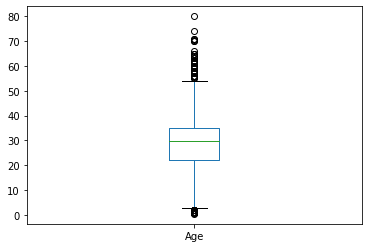
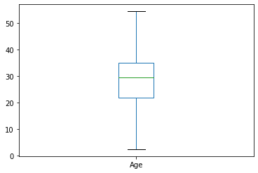
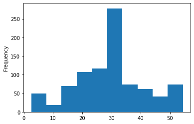
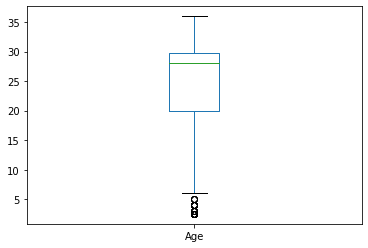

Bu aşamada da aykırı veri analizi yapalım. 


Demiştik ki aykırı veriler ile ilgili birden fazla yöntem uygulanabilir. Bunlardan bahsedelim. Bir defa aykırı veriler genellikle sürekli verilerde uygulanabilir diyeceğiz. Kategorik verilerde uygulanması pek mantıklı değildir. Aykırı verilere geçmeden önce veri setinde herhangi bir eksik veri olmadığından emin olmamız gerekiyor. O nedenle doldurma yapmamız gerekirse az önce gösterdiğimiz yöntemler ile veri doldurma yapmamız gerekir.


Aykırı verileri boxplot ile tespit edebiliriz demiştik.


```python
import numpy as np
import pandas as pd
import matplotlib.pyplot as plt

veri_seti = pd.read_csv("titanic.csv")
```


```python
# Veri setindeki yaş özelliği ile ilgilenelim. 
# Öncelikle yaş değişkeninin eksik verilerini dolduralım. 
veri_seti.Age
```


    0      22.0
    1      38.0
    2      26.0
    3      35.0
    4      35.0
           ... 
    886    27.0
    887    19.0
    888     NaN
    889    26.0
    890    32.0
    Name: Age, Length: 891, dtype: float64


```python
yas_dolu_veri_seti= veri_seti.Age.fillna(value=veri_seti.Age.mean())
```


```python
# Bir verilerimizi inceleyelim.
yas_dolu_veri_seti.describe()
```


    count    891.000000
    mean      29.699118
    std       13.002015
    min        0.420000
    25%       22.000000
    50%       29.699118
    75%       35.000000
    max       80.000000
    Name: Age, dtype: float64


```python
# Maksimum ile %75 arasında ciddi fark var. Burada aykırı veriler olabilir. 
# Minimum ile %%25 arasında da ciddi fark var orada da aykırı veri olabilir.
```


```python
# box plot ile aykırı veri olup olmadığını görebiliriz
yas_dolu_veri_seti.plot.box()
```


    <AxesSubplot:>





Yöntemler
- IQR yöntemi: Çeyrekler arası mesafe demekti. IQR değerini bulabilmek için öncelikle medyan belirlenir ardından üst ve alt limitler belirlenir. Bunlara Q1 Q2 Q3 demiştik. 
- Z-Skoru Yöntemi


```python
Q1 = yas_dolu_veri_seti.quantile(0.25)
Q3 = yas_dolu_veri_seti.quantile(0.75)
IQR = Q3-Q1
```


```python
Q1
```


    22.0


```python
Q3
```


    35.0


```python
IQR
```


    13.0


```python
alt_sinir = Q1-(IQR*1.5)
ust_sinir = Q3+(IQR*1.5)
print(alt_sinir)
print(ust_sinir)
```

    2.5
    54.5
    


```python
# 2.5 ile 54.5 olan değerler arasını alacağız diğerlerini 
# mesela ortalama ile veya Q3 ve Q1 ile değiştirebiliriz.

# alt sinirdan küçük olan değerler
yas_dolu_veri_seti[yas_dolu_veri_seti<alt_sinir]
```


    7      2.00
    16     2.00
    78     0.83
    119    2.00
    164    1.00
    172    1.00
    183    1.00
    205    2.00
    297    2.00
    305    0.92
    340    2.00
    381    1.00
    386    1.00
    469    0.75
    479    2.00
    530    2.00
    642    2.00
    644    0.75
    755    0.67
    788    1.00
    803    0.42
    824    2.00
    827    1.00
    831    0.83
    Name: Age, dtype: float64


```python
# üst sinirdan küçük olan değerler
yas_dolu_veri_seti[yas_dolu_veri_seti>ust_sinir]
```


    11     58.0
    15     55.0
    33     66.0
    54     65.0
    94     59.0
    96     71.0
    116    70.5
    152    55.5
    170    61.0
    174    56.0
    195    58.0
    232    59.0
    252    62.0
    268    58.0
    275    63.0
    280    65.0
    326    61.0
    366    60.0
    438    64.0
    456    65.0
    467    56.0
    483    63.0
    487    58.0
    492    55.0
    493    71.0
    545    64.0
    555    62.0
    570    62.0
    587    60.0
    625    61.0
    626    57.0
    630    80.0
    647    56.0
    659    58.0
    672    70.0
    684    60.0
    694    60.0
    745    70.0
    772    57.0
    829    62.0
    851    74.0
    879    56.0
    Name: Age, dtype: float64


```python
yas_dolu_veri_seti[yas_dolu_veri_seti<alt_sinir] = alt_sinir
```


```python
yas_dolu_veri_seti[yas_dolu_veri_seti>ust_sinir] = ust_sinir
```


```python
yas_dolu_veri_seti.describe()
```


    count    891.000000
    mean      29.376817
    std       12.062035
    min        2.500000
    25%       22.000000
    50%       29.699118
    75%       35.000000
    max       54.500000
    Name: Age, dtype: float64


```python
yas_dolu_veri_seti.plot.box()
```


    <AxesSubplot:>





```python
# IQR metodu ile aykırı verilerden kurtulmuş olduk.
```


```python
# z skoru için öncelikle verilerin normal dağılıma uygun olup olmadığı kontrol edilmelidir. 
# biz burada normal dağılıma uyduğu varsayımı ile hareket edelim.
yas_dolu_veri_seti.plot.hist()
```


    <AxesSubplot:ylabel='Frequency'>





```python
# 3 standart sapma ve üzerindekiler kaldırılırsa
yas_dolu_veri_seti[yas_dolu_veri_seti<yas_dolu_veri_seti.std()*3].plot.box()
```


    <AxesSubplot:>





```python
yas_dolu_veri_seti[(yas_dolu_veri_seti>yas_dolu_veri_seti.std()*-3)].plot.box()
```


    <AxesSubplot:>


```python

```
